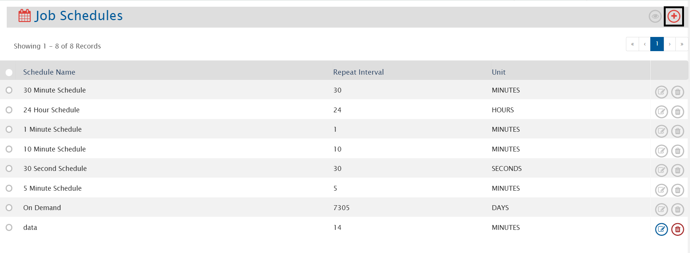
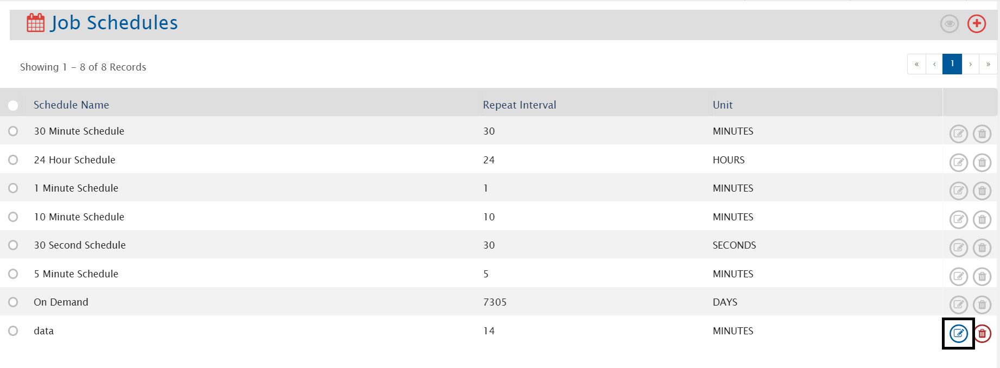
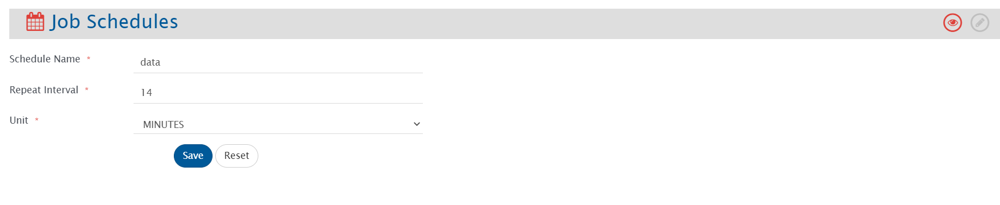
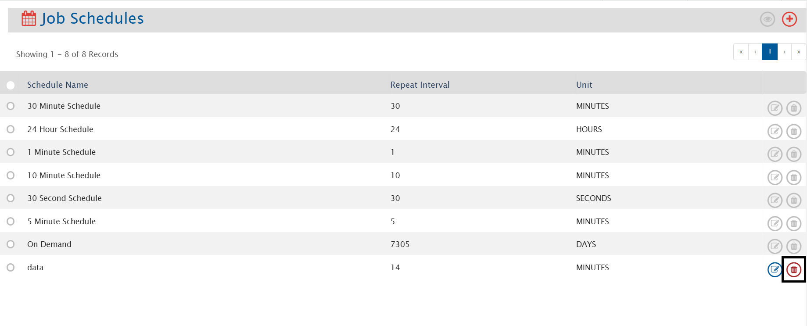
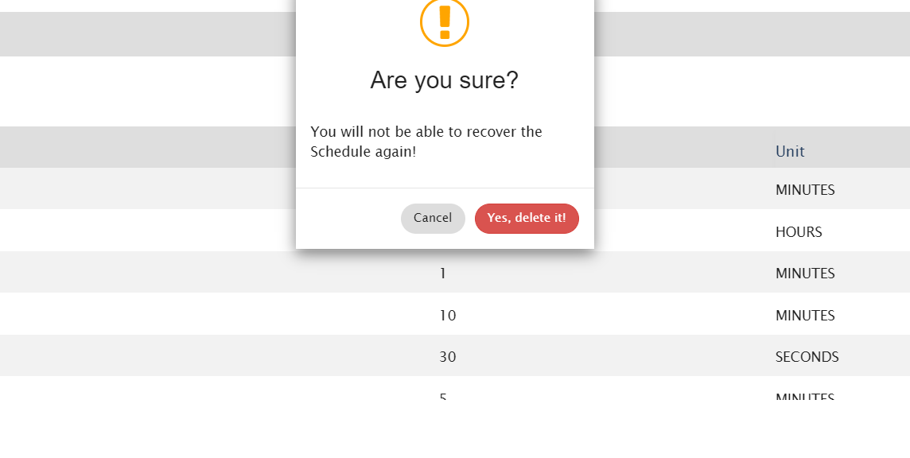

All the users in <code class="expression">space.vars.SITENAME</code>, who have a 'Professional' or 'Ultimate' license , will have access to 'Job Schedules' [which are associated with the integrations].

# Create Schedules

To create a new schedule, follow the steps given below:
* Click on **"Administration"**
* Click on  given on the left panel. You can see the list of schedules that are already created
* To create a new schedule, click on  given on the top right corner of the screen

  

* The Create Schedule screen will open. Fill the following details:
  * **Schedule Name**: Give the name of the schedule which you will create.
  * **Schedule Type**: Select the type of schedule which you want to create:
    * **Fix Schedule**: Integration will check for updates in end system at specified schedule.
    * **Interval Repetition**: Integration will check for the updates in end system at selected interval.
  * **Frequency**: Select the time duration at which the integration wil check for updates.

| **Schedule Type**     | **Frequency** | **Fields**           | **Description**                                                                                                                                               |
|-----------------------|---------------|-----------------------|---------------------------------------------------------------------------------------------------------------------------------------------------------------|
| **Interval Repetition** | All           | Repeat Interval       | It represents the unit of interval, i.e., MINUTES, HOURS, WEEKS, DAYS, SECONDS (If you select '5' as repeat interval and 'MINUTES' as unit, then integration will check for the updates every 5 minutes) |
| **Fix scheduler**      | All           | Start Time            | It represents the date and time from which the scheduler will start checking for updates in the end system.                                                  |
|                       |               | End Time              | It represents the date and time until the scheduler keeps checking for updates in the end system.                                                            |
|                       |               | Time                  | It represents the time at which the integration needs to check for updates in end system. Maximum 5 time slots can be given.                                |
|                       | Monthly        | Day                   | It represents the day at which the integration will check for the updates in the end system.                                                                 |
|                       |               | Week of Month         | It represents the week at which the integration needs to check for the updates in the end system.                                                            |
|                       | Weekly         | Day(s)                | It represents the day(s) at which the integration needs to check for the updates.                                                                            |

* Click on **"Save"**.

# Edit Schedule

* System generated schedules can't be edited
* To edit the schedule which is associated with active integration, first you need to inactivate the integration and then you can edit

* To edit a schedule, follow the steps given below:
  * Click on **"Administration"**
  * Click on  given on the left panel. You can see the list of schedules that are already created
  * To edit a schedule, click on  at the end of the corresponding schedule that you want to edit

  

* The Edit Schedule form will open. Edit the details in the form. Refer to the image below:

  

* Click on **"Save"**
* Click on **"Reset"** to set the previous saved value

# Delete Schedule

* System generated schedules can't be deleted
* To delete the schedule which is associated with any integration, first you need to remove this schedule from the integration and then you can delete 

* To delete a schedule, click on  at the end of a corresponding schedule that you want to delete

  

* You will not be able to restore the schedule once you delete it

  

* Click on **"Yes, delete it"** to delete the schedule
* Click on **"Cancel"** to cancel the process

