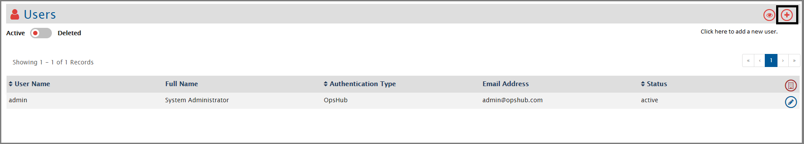
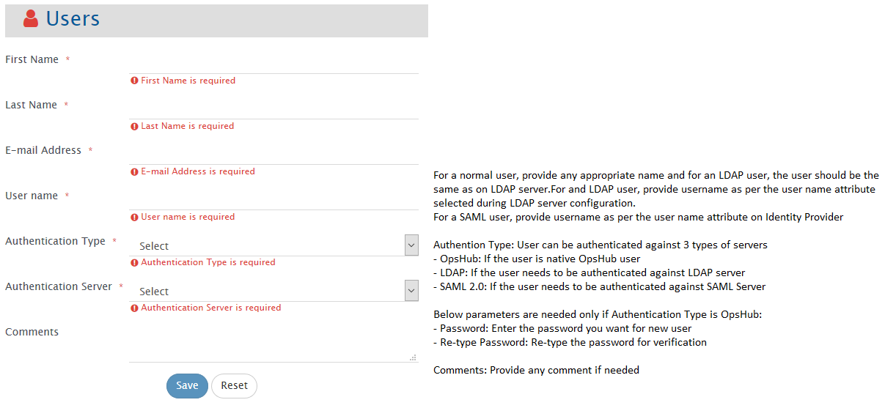
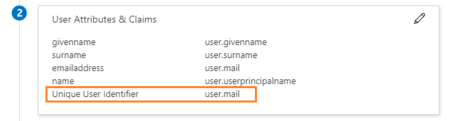

In this section, you will learn how to create and manage users. 

# Create User

Here is a video on how to create and manage users for different operations within OpsHub Integration Manager:

> **Note** : All the new users in OpsHub Integration Manager have administrator-level permissions. With the administrator-level permissions, the users will have access to all features.



To add a new user, follow the steps given below:
* Click **Administration**. 
* The **Users** page will open. You can see the list of users already added.
* To add a new user, click the plus sign (+) on the top right corner of the screen.
  

  

* The Create User form will open. Fill the following details in the form: 
  * First name of the user
  * Last name of the user
  * Email Address of the user
  * User name&#58; Provide name as per the username attribute on Identity Provider.  
    **Note:** For Azure Active Directory, it has to be same as 'Unique User Identifier'. To get 'Unique User Identifier' refer to [Username Identifier for Azure Active Directory](#username-identifer-for-azure-active-directory).

  

* You also need to fill the fields as shown in the image above. 
* Click **Save**.
  
> **Note** : All the new users have administrator-level permissions. With the administrator-level permissions, the users will have access to all features.

# Appendix

## Username Identifier for Azure Active Directory

* After logging in the Azure Active Directory,
  1. Go to **Enterprise applications**.
      
     

       
     
  
     
  3. Select your application from **All applications**.
     
     

       
     
  
     
  5. Select **Single sign-on** from left panel.
     
     

       
     
  
     
  7. Refer to section **User Attributes & Claims**.
     
     

       
     

> **Note** : The attribute which is specified in 'Unique User Identifer' should be used while defining the user's 'User name' in OpsHub Integration Manager. For example, here 'user.mail' is the selected attribute and so this property of the user from Azure Active Directory is to be used while defining 'User name' in OpsHub Integration Manager.

