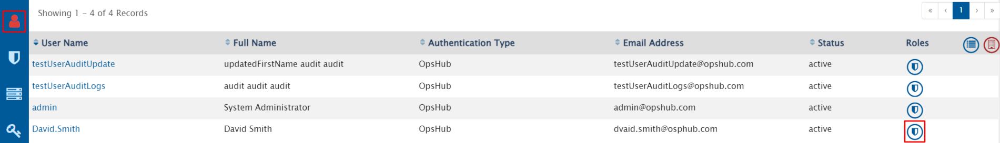
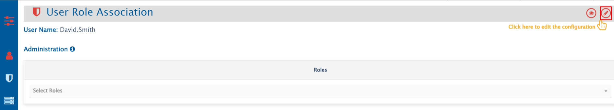
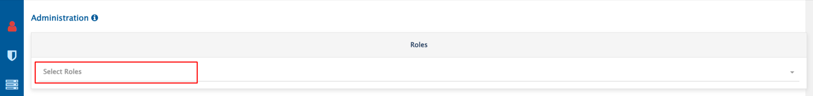
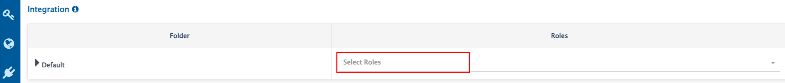
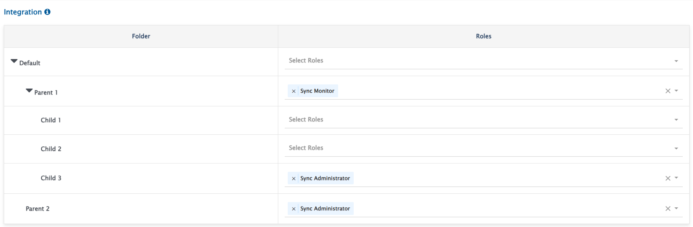

# Overview
* OpsHub Integration Manager allows to associate roles with users defining what actions a user can perform.
* One user can have multiple Integration and Administration Roles. The permissions available to that role will be a union of permissions associated with all individual roles.
* Only users with permission **Permission Grant** can associate roles with users.
* Roles can be associated with user from **View associated roles** button in rightmost column against a given user.

# Associating Administration Role to a User
* Navigate to user role association screen and click on edit icon in top right corner.

* Select roles to be associated with given user. Refer to [Permissions and Corresponding Actions](role-configuration.md#permissions-and-corresponding-actions) section to understand which operations can be performed based on the configured role.
* Under the drop down list, only Administration roles will be available. 
  * For instance, if Sync Administrator role is to be associated with user 'David Smith', it can be selected under Administration as shown below:

* Click on **Save** button to save user role association.

# Associating Integration Role to a User
* Navigate to User Role Association screen and click on edit icon in top right corner as shown below:

* Select roles to be associated with the given user. Refer to [Permissions and Corresponding Actions](role-configuration.md#permissions-and-corresponding-actions) section to understand which operations can be performed based on the configured role.
* Under the drop down list, only Integration roles will be available. 

* Here, roles can be assigned folder-wise.
* Permissions' Inheritance in Child Hierarchy:
  * Roles associated with given folder would be inherited in entire child hierarchy of that folder. 
  * Associating roles in the child folder will override roles of parent folder. 
* Assigning any role in a given folder indicates that user will have **Read** access to all integration resources in that folder and its child hierarchy as well.
* Assigning any role with **Read** access to integration or mapping in a child folder indicates **Read** access to all associated mappings and systems in the parent folder.

* For above configuration, the user will be able to perform the following operations:

| **Folder**                     | **Actions supported**                               |
|-------------------------------|------------------------------------------------------|
| Default/Parent 1              | All actions associated with **Sync Monitor** role   |
| Default/Parent 1/Child 1      | All actions associated with **Sync Monitor** role   |
| Default/Parent 1/Child 2      | All actions associated with **Sync Monitor** role   |
| Default/Parent 1/Child 3      | All actions associated with **Sync Administrator** role |
| Default/Parent 2              | All actions associated with **Sync Administrator** role |
