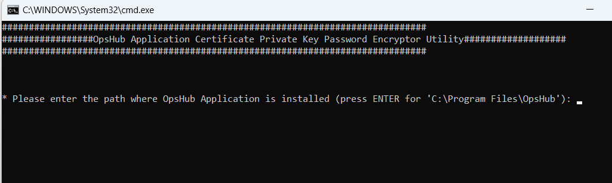
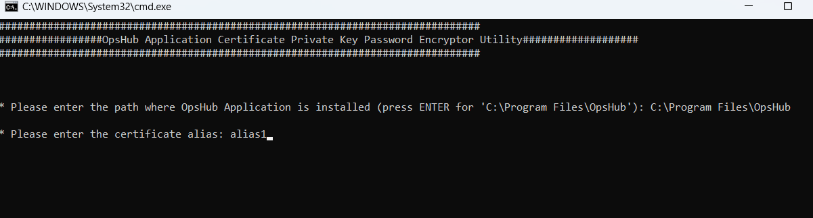
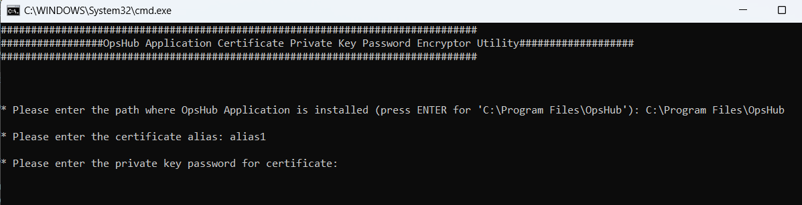
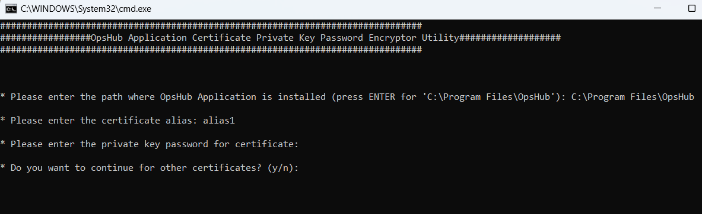
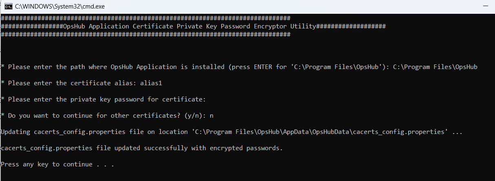

If multiple certificates are imported into the Keystore, and the certificates have different private key passwords, this utility can be used to create a `cacerts_config.properties` file having all the certificate alias names and their passwords in encrypted format. The information in this file would be used to load certificates from Keystore.

Follow the steps given below for creating/updating the `cacerts_config.properties` file:

* Stop OpsHub Server Service before execution of this utility.
* Navigate to `<OpsHub Integration Manager Installation Folder>/Other_Resources/Resources`.
* Unzip `OpsHub Certificate Passwords Utility.zip`.
* Run `OpsHubCertificatePasswordsUtility.bat` for Windows system. In case of Linux system, run `OpsHubCertificatePasswordsUtility.sh`.
* Enter the path for OpsHub Installation Directory.

  

* Enter the certificate alias as shown below:

  

* Enter the private key password of the certificate with the same alias as shown below:

  

* Type "y" if more alias entries need to be added. The utility will prompt for alias name and password again. Type "n" if no more entries are required.

  

* The utility will create `cacerts_config.properties` file with certificate alias names and their corresponding passwords in encrypted format.

  

* If the `cacerts_config.properties` file already exists, then this utility will not create this file, it will just replace the password for the existing alias or add the new alias and encrypted password in the existing `cacerts_config.properties`.

