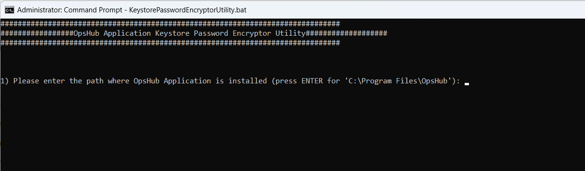
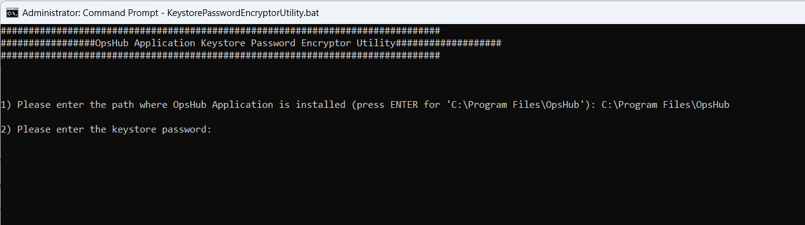
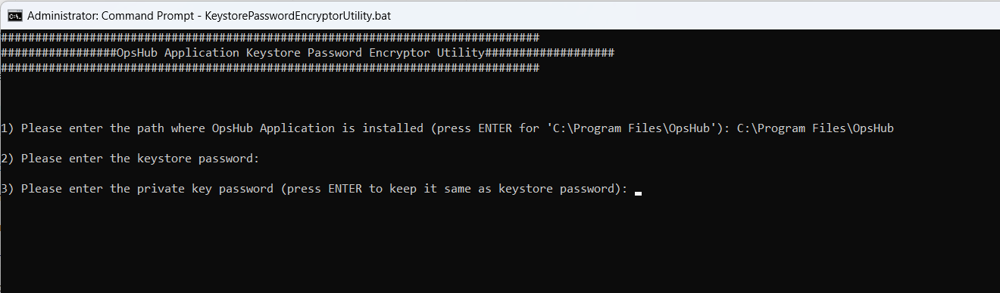
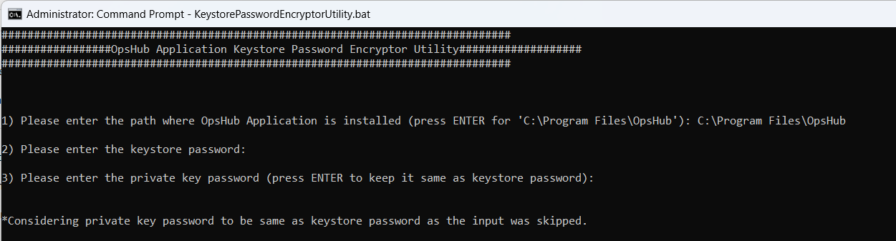
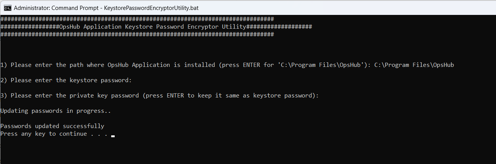

In case of HTTPS deployment of **<code class="expression">space.vars.SITENAME</code>**, if the user wants to change the existing keystore or private key passwords for **<code class="expression">space.vars.SITENAME</code>** certificate, this utility can be used to change and update the encrypted passwords in **<code class="expression">space.vars.SITENAME</code>** application.

Follow the steps given below for updating the encrypted keystore and private key passwords in **<code class="expression">space.vars.SITENAME</code>**:

* Stop OpsHub Server Service before execution of this utility.
* Navigate to `<code class="expression">space.vars.SITENAME</code> Installation Folder>/Other_Resources/Resources`.
* Unzip `"OpsHub Keystore Password Encryptor Utility.zip"`.
* Run `KeystorePasswordEncryptorUtility.bat` for Windows system. In case of Linux system, run `KeystorePasswordEncryptorUtility.sh`.
* Enter the path for OpsHub Installation Directory.

  

* Enter the keystore password.

  

* Enter the private key password.

  

*If the private key input is not entered in the above step, then user will get the notification mentioned in the screenshot below. In this case, the private key password will be considered same as keystore password.*

  

* It will update keystore and private key passwords in OpsHub application in the encrypted format.

  

