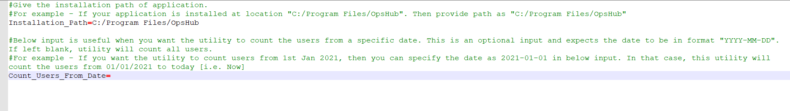

## Overview
* If user wants to know the count of users being synchronized through {{SITENAME}}, the 'UserCountUtility' utility can be used. This utility can count the following details of users whose data was synchronized from the first day of {{SITENAME}} setup (or a specific date) till date.
  * Unique Users across all systems configured 
  * Total Users across all systems configured
  * Total Users count per system 
  * Detailed list for each of the users as per their availability in the systems configured
* The utility **UserCountUtility.zip** is by default bundled with {{SITENAME}} installation and can be found at `<{{SITENAME}} Installation Folder>/Other_Resources/Resources/UserCountUtility.zip`. 
* The utility can be executed only from the machine where {{SITENAME}} is installed. 
* The utility folder contains following files:
  * input.properties: To provide the input details required to run the utility.
  * UserCountUtility.bat: To run the utility if {{SITENAME}} is installed on Windows machine.
  {{#ifeq: {{SITENAME}} | OpsHub Migrator for Microsoft Azure DevOps ||** UserCountUtility.sh: To run the utility if {{SITENAME}} is installed on Linux machine.}}

## Input
The following inputs are to be provided in input.properties file:
* **Installation_Path**  
  * Provide the installation path of {{SITENAME}}. For example, if {{SITENAME}} is installed at `C:/Program Files/{{#ifeq: {{SITENAME}} | OpsHub Migrator for Microsoft Azure DevOps | OM4ADO | OpsHub}}`, then provide path as `C:/Program Files/{{#ifeq: {{SITENAME}} | OpsHub Migrator for Microsoft Azure DevOps | OM4ADO | OpsHub}}`.
* **Count_Users_From_Date**  
  * It is useful when the user wants the utility to count the users from a specific date. This is an optional input and the date should be in the format, `YYYY-MM-DD`. If left blank, utility will count all users. For example, if the user wants the utility to count users from 1 Jan. 2021, then the user can specify the date as `2021-01-01`. In that case, this utility will count the users from 1 Jan. 2021 till date. 

Below is an example of input.properties file:

  

## Steps to run Utility
Following are the steps to run the utility: 
* Go to `<{{SITENAME}} Installation Folder>/Other_Resources/Resources`. 
* Unzip `UserCountUtility.zip`. 
* Update the `input.properties` file as stated [here](#input).
* {{#ifeq: {{SITENAME}} | OpsHub Migrator for Microsoft Azure DevOps | Close OM4ADO application before execution of the utility |Stop OpsHub Server Service before execution of the utility }}
* If your {{SITENAME}} is installed on Windows machine, then refer to the steps given below:
  * Open Command Prompt
  * Navigate to `<{{SITENAME}} Installation Folder>/Other_Resources/Resources` path
  * Execute the bat using command `UserCountUtility.bat` as shown below:  

  

{{#ifeq: {{SITENAME}} | OpsHub Migrator for Microsoft Azure DevOps ||
* If your {{SITENAME}} is installed on Linux machine, then refer to the steps given below: 
  * Open Shell Script
  * Navigate to `<{{SITENAME}} Installation Folder>/Other_Resources/Resources` path
  * Execute the bat using command `sh UserCountUtility.sh` as shown below:

  

 
}}

Once the execution is completed, the user will see the output similar to the details given in the screenshot (an example of execution on Windows machine) below:

  

## Output
Once the utility execution starts, it creates a folder `output` which contains below files for the user count reports and utility execution logs:
1. **UserCountSummary.csv**: It contains count of unique users across all systems configured, total users count across all systems configured and total users count per system. For more information, refer to [UserCountSummary](#usercountsummarycsv) section.
2. **UserCountDetailedReport.csv**: It contains detailed list for each users as per their availability in the systems configured. For more information, refer to [UserCountDetailedReport](#usercountdetailedreportcsv) section.
3. **logs.log**: It contains the details of the utility execution.

### UserCountSummary.csv
This file contains the following details:
* **Total Unique**  
  * It represents the number of unique users present in the synchronization done so far across all the systems configured. For example, if the user is present in {{#ifeq: {{SITENAME}} | OpsHub Migrator for Microsoft Azure DevOps | the configured systems [TFS,ADO] | three configured systems [Jira, Jama Connect, Cadence Verisium Manager]}}. There is a user (with email: `demouser@test.com`) who is present in both {{#ifeq: {{SITENAME}} | OpsHub Migrator for Microsoft Azure DevOps | TFS and ADO | Jira and Jama Connect}}, then, the user will be considered unique. For the users with no specified emails, in that case, their usernames will be considered unique.
* **Total**  
  * It represents the total number of users in all the systems.
* **Distribution of users per system**  
  * It has the list of systems and the number of users synchronized by {{SITENAME}}.

  

### UserCountDetailedReport.csv
* It has a detailed report on the users found during synchronization.
* It has the user details (User Email or User Name as per the details found during synchronization). Additionally, a corresponding list of systems is present in which the users' details are found.

  

