  
* Close OM4ADO application before execution of the utility.
  

* Stop OpsHub Server Service before execution of the utility.
 
* Go to <code class="expression">space.vars.SITENAME</code>'s `<Installation Folder>/Other_Resources/Resources` 
* Unzip `HostChange.zip`  
  
* Open Command Prompt with administrator privileges and go to <code class="expression">space.vars.SITENAME</code>'s directory `<Installation Folder or OM4ADO>/Other_Resources/Resources/HostChange` using command  **`cd <Installation Folder or OM4ADO>/Other_Resources/Resources/HostChange`**


* Open Command Prompt with administrator privileges and go to <code class="expression">space.vars.SITENAME</code>'s directory `<Installation Folder or OpsHub>/Other_Resources/Resources/HostChange` using command  **`cd <Installation Folder or OpsHub>/Other_Resources/Resources/HostChange`**

* Run `HostChange.bat` for Windows system.  In case of linux system, run HostChange.sh 

* Enter the path for  OM4ADO  OpsHub  Installation Directory

  

## HostChange with MYSQL

* Enter the new Host Name for MYSQL: 

  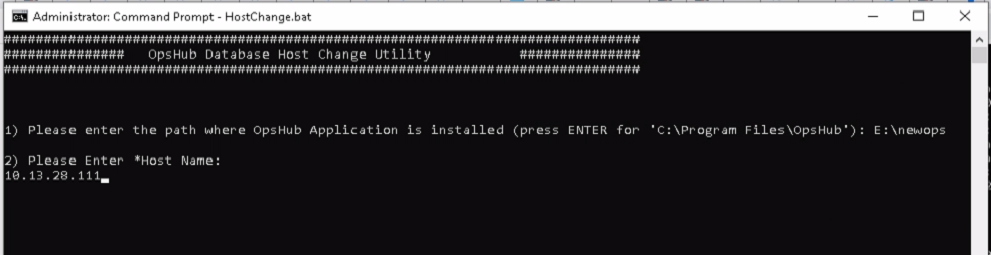

* If the Host Name input is not entered in the above step, then user will get the notification mentioned in the screen shot below. As the Host Name is a mandatory input that defines the new Host Name you want <code class="expression">space.vars.SITENAME</code> database to refer to: 

  

* Enter the Port for MYSQL:

  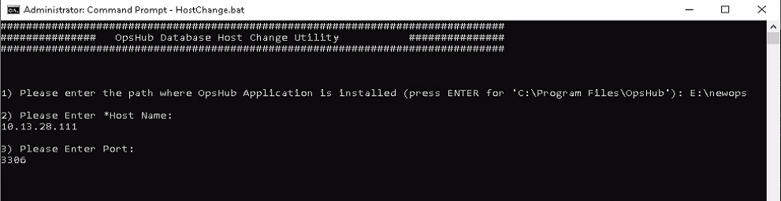

* If the Port input is not entered in the above step, then utility will use the existing Port [entered at a time of <code class="expression">space.vars.SITENAME</code> installation]. If that is not the case, then enter the Port here:

  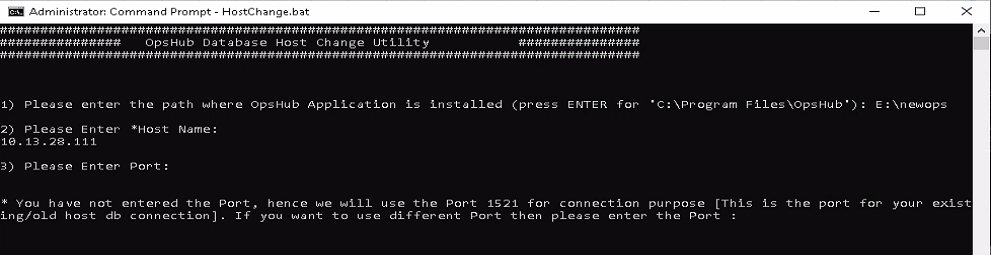

* Utility will check the connection with new Host Name: 

  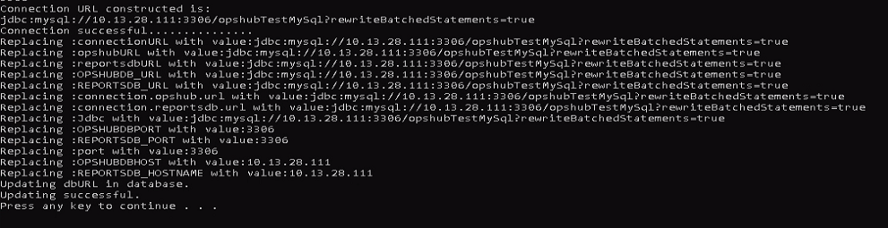

## HostChange with ORACLE

* Enter the new Host Name for ORACLE:

  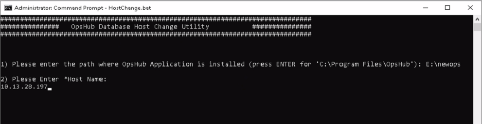

* If the Host Name input is not entered in the above step, then user will get the notification mentioned in the screen shot below. As the Host Name is a mandatory input that defines the new Host Name you want <code class="expression">space.vars.SITENAME</code> database to refer to:  

  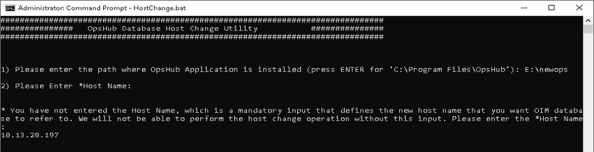

* Enter the Port for ORACLE:

  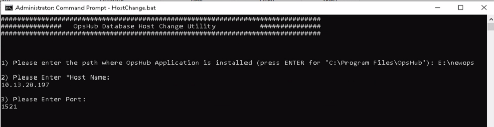

* If the Port input is not entered in the above step, then utility will use the existing Port [entered at the time of <code class="expression">space.vars.SITENAME</code> installation]. If that is not the case, then enter the Port here:

  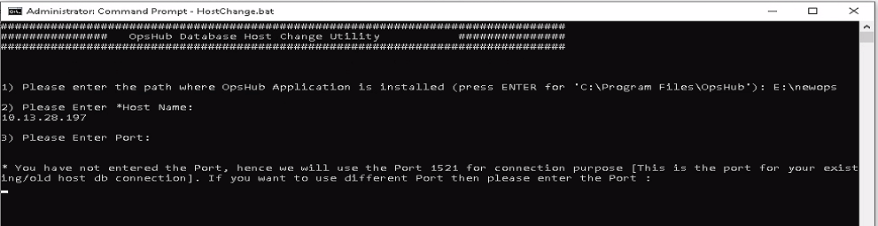

* Utility will check the connection with new Host Name:   

  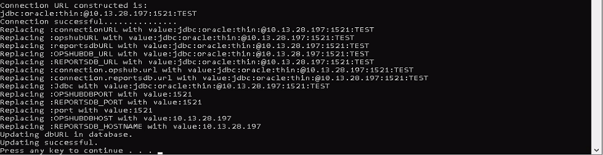

## HostChange with MSSQL Server

* **Note**: If <code class="expression">space.vars.SITENAME</code> is installed with Windows Authentication mode, then before running the utility, the user needs to make sure that the user who is logged into the Windows [where the <code class="expression">space.vars.SITENAME</code> is installed] also logs into the new host's MSSQL instance with the same credentials.

* Enter the new Host Name for MSSQL Server: 

  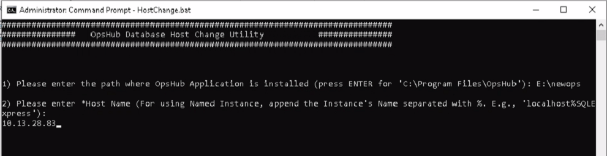

* If the Host Name input is not entered in the above step, then user will get the notification mentioned in the screen shot below. As the Host Name is a mandatory input that defines the new Host Name you want <code class="expression">space.vars.SITENAME</code> database to refer to: 

  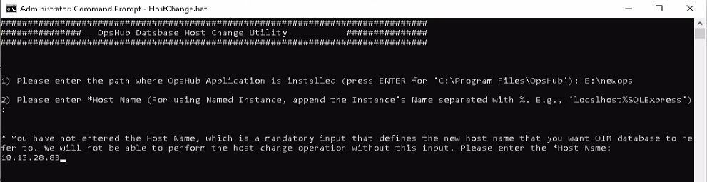

* If the new Host Name is a named instance, then there is no input required for the Port. Hence, after entering the Host Name, utility will check the connection with the new Host:

  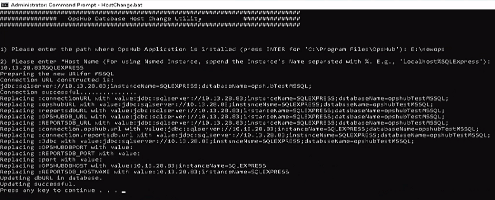

* If the new Host Name is a non-named instance, then enter the Port for MSSQL:

  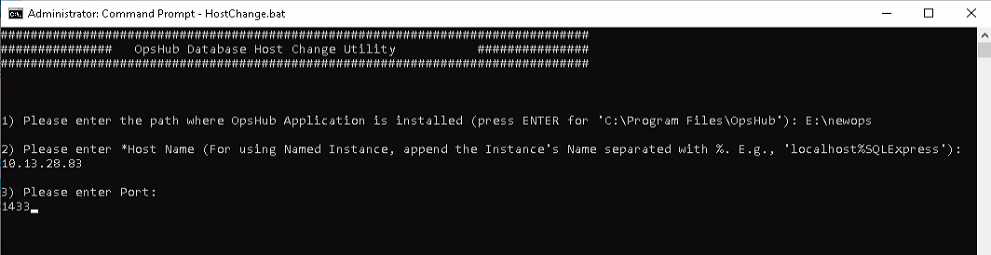

* If the Port input is not entered in the above step, then utility will use the existing Port [entered at the time of <code class="expression">space.vars.SITENAME</code> installation]. If that is not the case, then enter the Port here:

  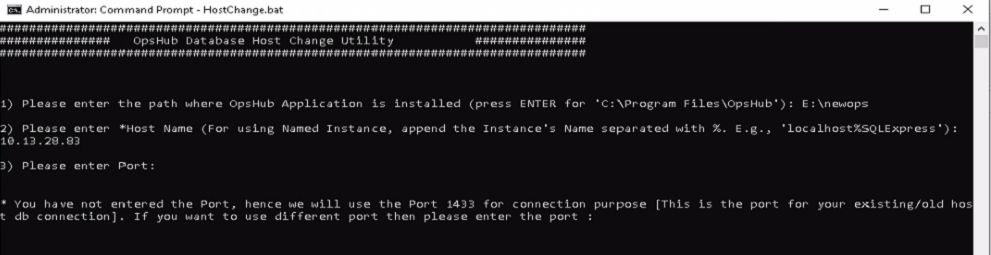

* Utility will check the connection with new Host Name [In the case of SQL Authentication]:

  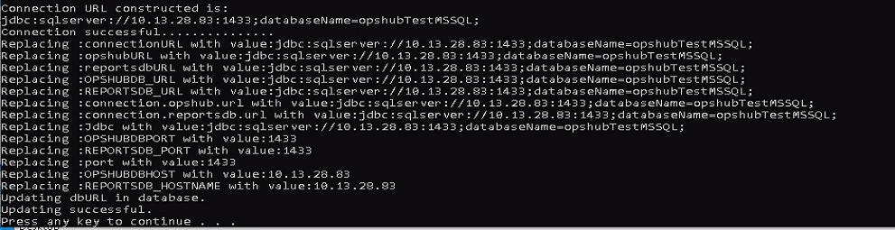

* Utility will check the connection with new Host Name [In the case of Windows Authentication]:

  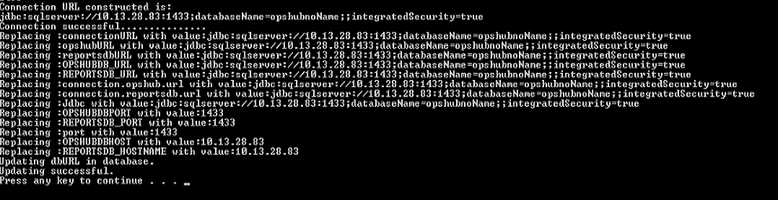

## HostChange with PostgreSQL

* Enter the new Host Name for PostgreSQL:

  

* If the Host Name input is not entered in the above step, then user will get the notification mentioned in the screenshot below. The Host Name is a mandatory input that defines the new Host Name user wants <code class="expression">space.vars.SITENAME</code> database to refer to:

  

* Enter the Port for PostgreSQL:

  

* If the Port's input is not entered in the above step, then the utility will use the existing Port [entered at the time of <code class="expression">space.vars.SITENAME</code> installation]. If that is not the case, enter the Port as shown in the screenshot below:

  

* Utility will check the connection with the new Host Name:

  

