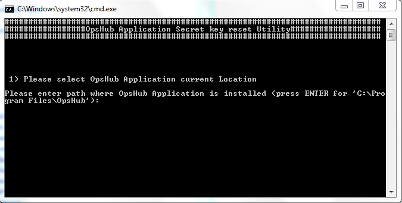
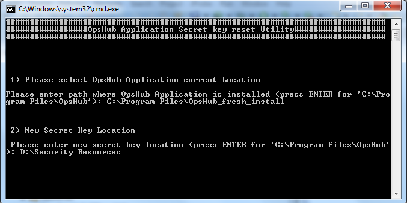
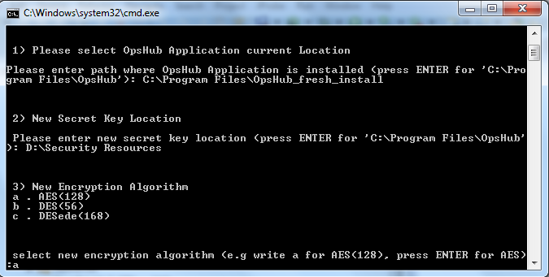
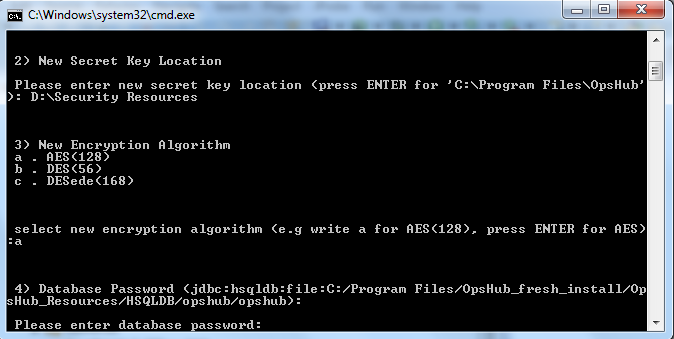
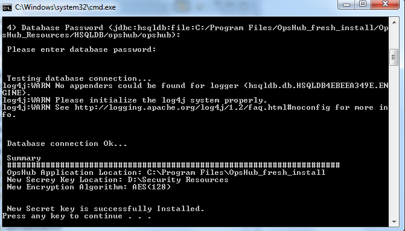

This utility regenerates Secret Key for application. This can be used in following cases:
* Secret Key is lost.
* Secret Key has been tampered.
* User wants to change secret key for application.

Please follow below given steps for execution of this utility:

* Stop OpsHub Server/ Service before execution of this utility.
* Go to `<OpsHub Installation Folder>/Other_Resources/Resources`.
* Unzip `OpsHub Secret key reset utility.zip`.
* Execute `OpsHubSecretKeyResetUtility.bat` / `OpsHubSecretKeyResetUtility.sh` for Windows/Linux respectively.
* Enter path for OpsHub Installation Directory.

  

* Enter new location for security. (`opshub.key` should not be available on the same location).

  

* Select Data Encryption algorithm. By default, AES (128) is selected.

  

* Provide password for database. 

  

* This would generate new key at specified location.

  

* In case of HTTPS deployment of **<code class="expression">space.vars.SITENAME</code>**, run [Change Keystore and Private Key passwords utility](change-keystore-and-private-key-passwords.md) to store the passwords in encrypted form.

* Start OpsHub Server/ Service.  
* Re-enter passwords for all configured systems, configured database connections, configured proxy settings and overridden passwords in Advance Configuration of Integration.

