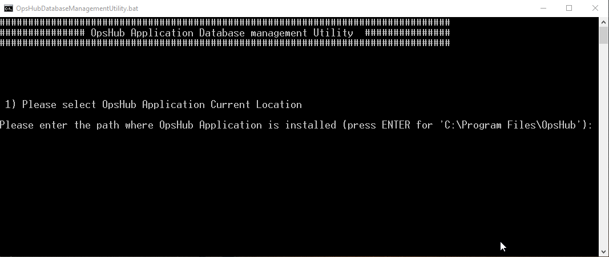
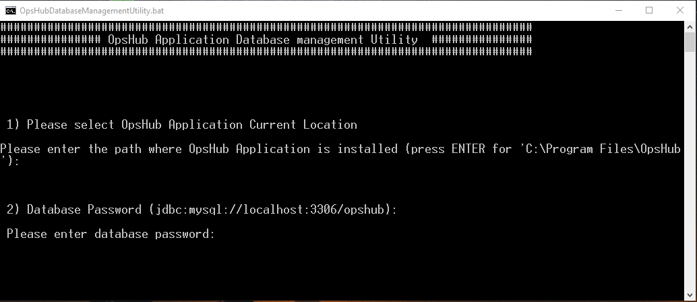
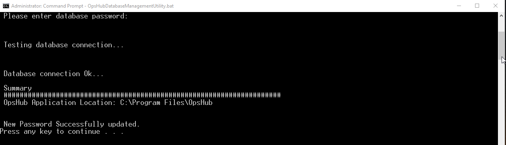

If <code class="expression">space.vars.SITENAME</code> database password has been modified by a user, then this utility would update the new password in **<code class="expression">space.vars.SITENAME</code>** application.

Follow the steps given below for updating database password in OpsHub:


* Stop OpsHub Server/ Service before execution of this utility.



* Close OM4ADO application before execution of the utility.


* Go to <code class="expression">space.vars.SITENAME</code> Installation Folder>/Other_Resources/Resources.
* Unzip `OpsHub Database Management utility.zip`.
* Run `OpsHubDatabaseManagementUtility.bat` for Windows system. 
   In case of Linux system, run `OpsHubDatabaseManagementUtility.sh`.
* Enter path for OpsHub Installation Directory.

  

* Enter the new database password.

  

* This would update database password in OpsHub application.

  

