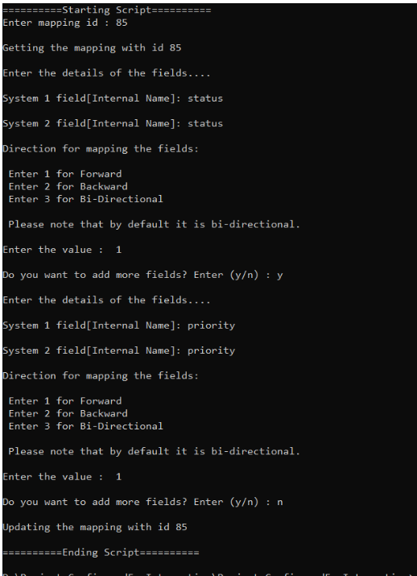

# Description

- If you want to add fields to an existing mapping, then you can use this sample script.

# Input

- Instance details:
  - Instance details like <code class="expression">space.vars.SITENAME</code> instance URL, username and password are to be given in **instanceDetails.properties** file available within script.

- Mapping details (to be given at the time of script execution):
  - Mapping id to be updated.
  - Internal name of the field of system 1.
  - Internal name of the field of system 2.

## Output

- Updated mapping

## Script

You can download the script from [here](https://opshub.com/ohftp/AdminAPI/addFieldsToMapping.zip).

Below is an example of execution of script which shows the input and output:

  

