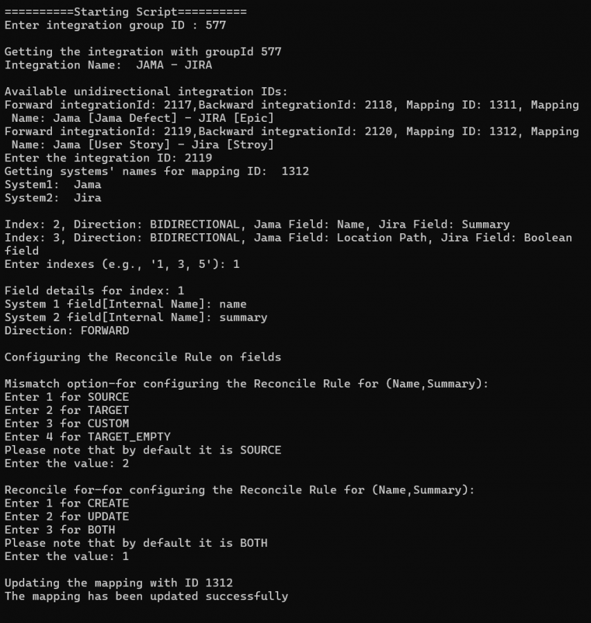
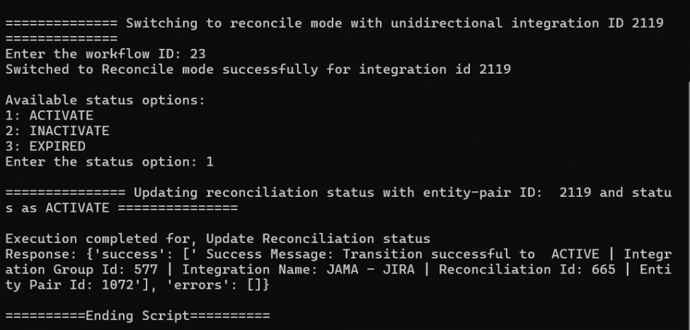

# Description

- To set reconcile rule on the existing mapping and configure reconciliation, use this sample script.

# Input

- Instance details:
  - Instance details like <code class="expression">space.vars.SITENAME</code> instance URL, username and password are to be given in **instanceDetails.properties** file available within script.

- Integration details (to be given at the time of script execution):
  - Integration Group id on which Reconciliation is to be configured.
  - Select directional integration id.

- Mapping details (to be given at the time of script execution):
  - Select the mapped fields on which Reconcile Rule is to be configured
  - Select **Mismatch**, and **Reconcile For** options for each field.

- Reconciliation details (to be given at the time of script execution):
  - Workflow id (should be a type of Reconciliation)
  - Select the reconciliation status

# Output

- Configured Reconciliation for given fields in an Integration.

# Script

You can download the script from [here](https://opshub.com/ohftp/AdminAPI/configureReconciliationOnExistingIntegration.zip).

Below is an example of execution of script which shows the input and output:

  

  

