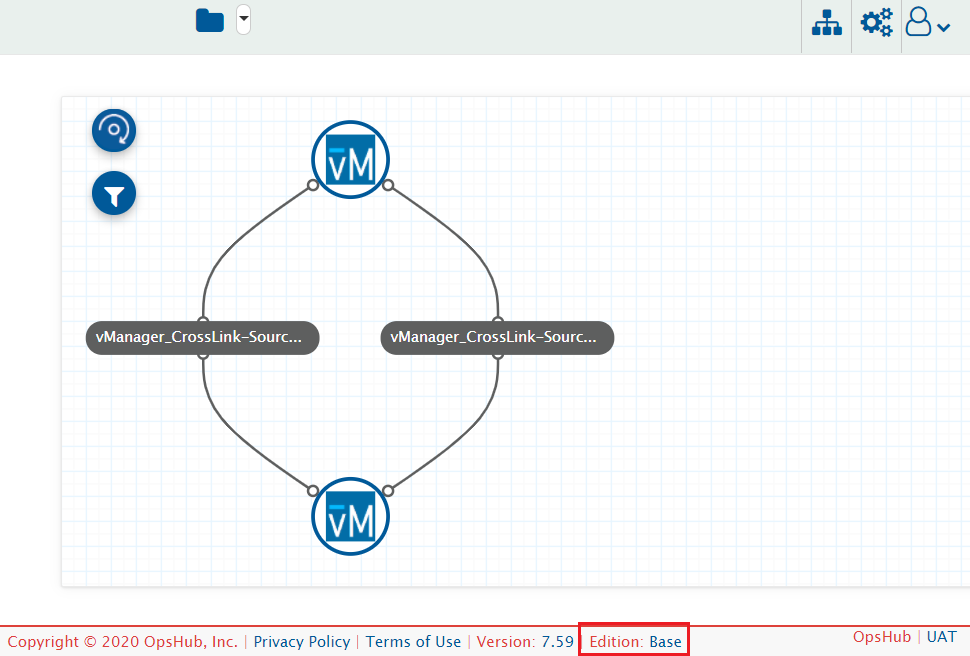
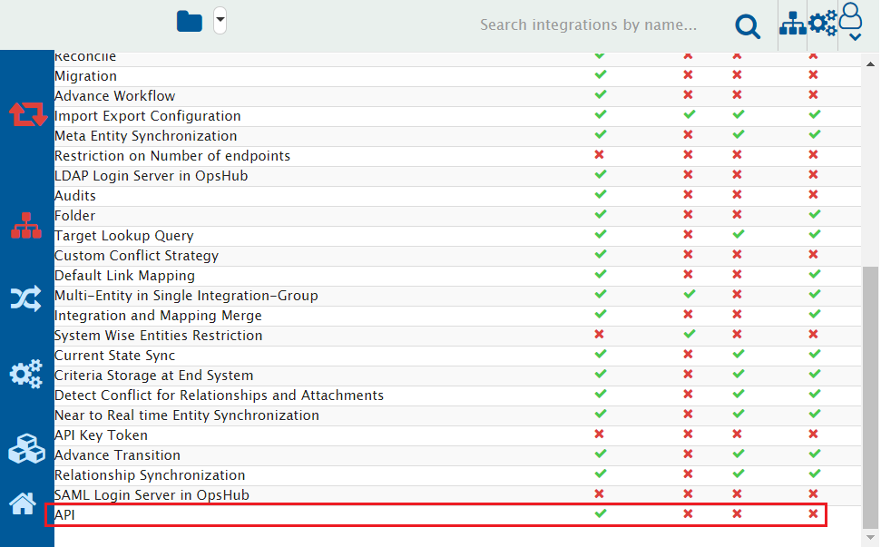

# Overview

{{SITENAME}} has rich user interface for achieving the integration configurations and using other functionality of {{SITENAME}}. However, there can be various cases where the user might need to achieve/use them programmatically, i.e., with the external script, external software program, or with some API client, and {{SITENAME}} API is useful in such cases. It is an alternate way to communicate with the {{SITENAME}}.

The {{SITENAME}} API is organized around REST and uses [JSON](https://www.json.org/json-en.html) format for data exchange.

To have a quick look on the use cases samples and {{SITENAME}} API usage examples, please refer to [Use Cases](sample-use-cases.md).

# Prerequisites

Following are the prerequisites to use {{SITENAME}} API:

## Access to {{SITENAME}} Instance

- An active instance of {{SITENAME}} which needs to be accessible from the machine/[platform](#platforms) for invoking the {{SITENAME}} API.
- URL of {{SITENAME}} instance. Example: `http://10.13.20.20:8989/OIM/` or `https://10.13.20.20:8443/OIM/`.
- User credentials for accessing the {{SITENAME}} instance.  
>**Note**: Please refer to [Validate access](#validate-access-to-opshub-integration-manager-instance) for validating this prerequisite.

## API License

- Usage of {{SITENAME}} API requires "API" add-on in the {{SITENAME}} license.  
>**Note**: Please refer to [Validate API feature](#validate-api-feature) to determine whether the "API" feature is enabled or not on your {{SITENAME}} instance.

## Platforms

- {{SITENAME}} APIs can be invoked from the platform which can make the REST API Calls.
  - API client such as [postman](https://www.postman.com/).
  - Programs written in any programing language which has support for HTTP or HTTPS communication.
  - Command line tool such as [curl](https://curl.se/).

# Access to API

Access to API will be available for your instance with URL like below:

<code>&lt;Protocol&gt;://&lt;Host Name or IP address of {{SITENAME}} instance&gt;:&lt;Port Number&gt;/OIM/rest/api/docs</code>

**For example** – If the application url of {{SITENAME}} is `http://10.13.20.20:8989/OIM/`, then the Swagger UI will be available at `http://10.13.20.20:8989/OIM/rest/api/docs`.

# Appendix

## Validate API feature

To check whether the "API" feature is enabled in the {{SITENAME}} or not, please perform the below steps:

1. [Login](../../getting-started/logging-in.md) to {{SITENAME}} with the valid {{SITENAME}} user credentials.
2. Navigate to the Footer and find "Edition" value.
3. Click on the Edition value of the {{SITENAME}}
   

4. Please make sure the "API" feature is enabled.
   

 >**Note**: If this feature is disabled, and you have the license in which this feature is available, then please [install](Managing_Licenses) the correct license. If you don’t have a valid license, please reach out to OpsHub Sales/Support team for receiving the appropriate license.

## Validate access to OpsHub Integration Manager instance

To check whether the {{SITENAME}} instance is accessible or not, please perform the below steps:

1. Open {{SITENAME}} instance URL from any browser from the machine/platform where {{SITENAME}} APIs are invoked.
2. Access the {{SITENAME}} instance from browser using the credentials you want to use for {{SITENAME}} API communication.
3. If you can successfully login, this prerequisite is met.  
 >**Note**: If {{SITENAME}} is configured on HTTPS, then SSL certificates needs to be imported based on the chosen platform:
   - For the API clients like [postman](https://www.postman.com/), there are some [steps](https://learning.postman.com/docs/sending-requests/certificates/) to configure it.
   - For the [curl](https://curl.se/) command, this can be [configured using -cert](https://curl.se/docs/manpage.html) option.
   - For the programs, the steps will differ based on the expectation of the programming languages in which it was written.

# Known Limitations

1. SAML Users won't be able to login through the API.
   - Let's say the user has configured SAML login for OIM UI Login. Such users won't be able to login through the API. It would need either Default or LDAP user.

