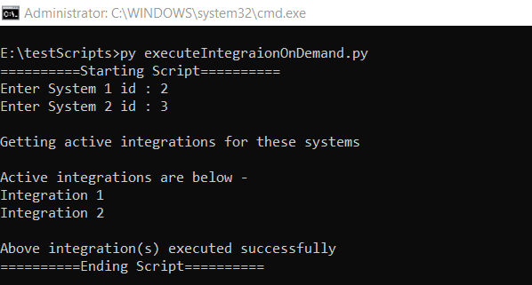

# Description

- Given two systems, if you want to execute/trigger all active integration configured between those systems, then you can use this sample script.

# Input

- Instance details  
  - Instance details like <code class="expression">space.vars.SITENAME</code> instance url, username and password are to be given in **instanceDetails.properties** file available within script.
- End Point details (To be given at the time of script execution)  
  - End Point 1 Id  
  - End Point 2 Id

# Output

- List of all active integrations between the two systems that were successfully executed.

# Script

You can download the script from [here](https://opshubtrial-my.sharepoint.com/:u:/g/personal/support_opshub_com/EdaLRfGX_KRAoyYTssd-kswBT1VC_QfpRCwwYMkGhAx7rQ).

Below is an example of execution of script which shows the input and output.

  

