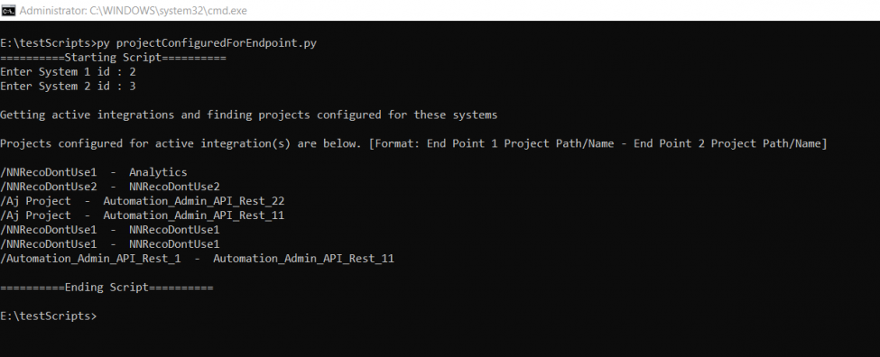

# Description

- Given two systems, if you want to get the projects in synchronization (for all active integration configured) between those systems, then you can use this sample script.

# Input

- Instance details  
  - Instance details like OpsHub Integration Manager instance url, username and password are to be given in **instanceDetails.properties** file available within script.
- End Point details (To be given at the time of script execution)  
  - End Point 1 Id  
  - End Point 2 Id

# Output

- List of project pairs configured in all the active integrations between the two systems.

# Script

You can download the script from [here].

Below is an example of execution for this script.

