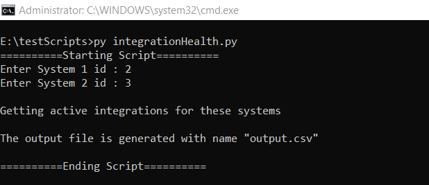
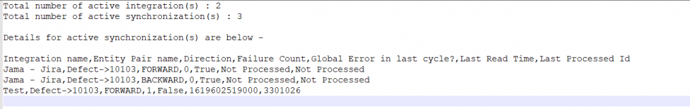

# Description

- If you want to get the health status of all active integrations between two systems, then you can use this sample script.
- Health status includes number of active integrations, failure count for all integrations, global failure present or not, etc.

# Input

- Instance details  
  - Instance details like OpsHub Integration Manager instance url, username and password are to be given in **instanceDetails.properties** file available within script.
- End Point details (To be given at the time of script execution)  
  - End Point 1 Id  
  - End Point 2 Id

# Output

- Number of active integrations
- Number of active synchronizations
- Synchronization details like synchronization direction, failure count present in the integration, was there any global error in last cycle?, global error timestamp.

# Script

You can download the script from [here](https://opshubtrial-my.sharepoint.com/:u:/g/personal/support_opshub_com/EcIhGxnr2M9Nt1mK2w-i7ZAB0O2XJ1-Sc8q8OnWYgZqPGg).

Below is an example of execution of script which shows the input and output.

  

  

