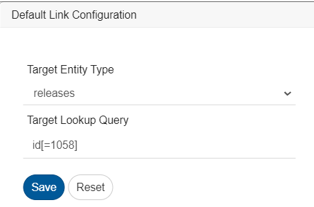

# post-migration-checklist

> 👉 **Looking for older version steps?**\
> Refer to the [Post-Migration Checklist (MediaWiki)](https://docs.myopshub.com/oim/index.php/Post-Migration_Checklist) for {{SITENAME}} versions prior to 7.195.

## Migrating {{SITENAME}} version to 7.175 or above

### Update the Advance XSLT used for Jira Zephyr Test-step results

**Applicable When**

* System: Jira Zephyr
* Entity: Test Execution
* Field: Step Results
* Scenario: Step Result field is mapped as a source using advance XSLT.

**Actions**

* The source XML path for the step result field needs to be changed. Replace the following instance with mentioned replacement:
  * `[SourceXML/updatedFields/Property/stepResult/*]` replace with `[SourceXML/updatedFields/Property/stepResult/Property/*]`
* Replace the path of step result fields with `Property/[fieldName]`:
  * Example: Replace `status` with `Property/status`
* For more details refer: [Sample advanced mapping for Jira Zephyr Test Execution](../../connectors/jira.md#supported-relationships)

**Reason**

* Step Results were stored as a List in old values, and as a Hashmap in new values. This inconsistency can cause failures in parsing list of step results correctly.
* For maintaining consistency between old values and new values in the event xml, the format has been changed to List of step results.

### Change the SAML IDP Single sign-on URL

**Applicable When**

* SAML-based authentication is configured in {{SITENAME}}.

**Actions**

* The user has already configured SAML Identity Provider. Example., OKTA, Azure Active Directory, etc.
* In SAML Identity Provider configuration, the user can find the single sign-on URL field under the SAML settings.
* The user must change the single sign-on URL in SAML Identity Provider when {{SITENAME}} is installed with HTTP protocol:
  * Current configuration: `http://localhost:8989/OpsHubWS/saml/SSO`
  * Updated URL configuration must be: `http://localhost:8989/OpsHubWS/login/saml2/sso/opshubsaml`
* The user must change the single sign-on URL in SAML Identity Provider when {{SITENAME}} is installed with HTTPS protocol:
  * Current configuration: `https://localhost:8443/OpsHubWS/saml/SSO`
  * Updated URL configuration must be: `https://localhost:8443/OpsHubWS/login/saml2/sso/opshubsaml`

**Reason**

* Going forward, {{SITENAME}} will use Spring Security Saml2 service provider to support SAML-based authentication. It will also eliminate vulnerabilities of older SAML framework.

## Migrating {{SITENAME}} version to 7.176 or above

### Update .NET framework to 4.7.2 or above

**Applicable When**

* OpsHubEAWindowsService is configured on a machine with a .NET framework version below 4.7.2.

**Actions**

*   Install .NET framework 4.7.2 on the machine where OpsHubEAWindowsService is configured.

    * Check [software and hardware requirements](https://docs.microsoft.com/en-us/dotnet/framework/get-started/system-requirements) to install .NET Framework 4.7.2

    > **Note** : We recommend to uninstall any other .NET framework installed previously, to avoid any conflict.

**Reason**

* .NET Framework version 4.0 is out of support. Therefore, dependency on .NET framework version 4.0 has also been removed.

## Migrating {{SITENAME}} version to 7.177 or above

### Workflow Change for Any Customized Workflow

Pls refer, [How to identify between Custom and Default Workflows and their associated integrations?](../../integrate/how-to-identify-between-custom-and-default-workflows-and-their-associated-integrations.md)

**Applicable When**

* The user has configured a customized workflow that is still in use.

**Actions**

* If advanced customizations are applied using old system and custom properties, users must open the customized workflow and update it to ensure compatibility with the current expected format to avoid failures.
* From version 7.177 onward, when retrieving specific properties from old values, the syntax of the code snippet needs to be updated to avoid conflicts.

**Workflow Code Example**

**Before modification:**

```java
HashMap sysProp = mappedProperties.get(Constants.NEWSYSTEMPROP);
HashMap custProp = mappedProperties.get(Constants.NEWCUSTOMPROP);
HashMap oldSystemValues = mappedProperties.get(Constants.OLDSYSTEMPROP);
HashMap oldCustomValues =  mappedProperties.get(Constants.OLDSYSTEMPROP);

// code comment: fetching avoid conflict map from old custom values
HashMap avoidConflictCustProps = oldCustomValues.get("AvoidConflict");
// code comment: fetching status value from avoid conflict map
String status = avoidConflictCustProps.get("Status");
```

**After modification:**

```java
HashMap sysProp = mappedProperties.get(Constants.NEWSYSTEMPROP);
HashMap custProp = mappedProperties.get(Constants.NEWCUSTOMPROP);
HashMap oldSystemValues = mappedProperties.get(Constants.OLDSYSTEMPROP);
HashMap oldCustomValues =  mappedProperties.get(Constants.OLDSYSTEMPROP);

// code comment: fetching status value from old custom values
String status = oldCustomValues.get("status");
```

#### Reason

Starting with version 7.177, all properties are directly accessible from the old properties map. The intermediate "avoid conflict" map has been removed.

***

## Migrating {{SITENAME}} version to 7.181 or above

### Remap values of lookup field when it contains special character(s)

#### Applicable When

Values for lookup field contains special characters (tab space) in the source/target system, even though these special characters are not visible in the lookup values of {{SITENAME}}.

#### Actions

After upgrading {{SITENAME}}, remap the lookup field that contains lookup values with the above specified special characters.

The following specified characters need to have their lookup field values remapped:

* Tab Space: `\t`

#### Reason

To regenerate XSLT to synchronize the actual value with the above mentioned special characters.

***

### Update Relationship Configuration for OpenText ALM Octane Endpoint

#### Applicable When

The user has configured any of the following relationship in integration configuration involving OpenText ALM Octane Endpoint. Originated defect, Originated feature, Originated epic, Originated user story, Originated quality story, Original defect, Original feature, Original epic, Original user story, Original quality story.

#### Prerequisite

Resolve all the failures for the configurations that requires update.

#### Actions

Open mapping configurations with mention relationships configured. Remove mentioned linkages and replace them as per following new linkages:

| Old link name            | New link name              |
| ------------------------ | -------------------------- |
| Originated defect        | Defect (Trace to)          |
| Originated feature       | Feature (Trace to)         |
| Originated epic          | Epic (Trace to)            |
| Originated user story    | Story (Trace to)           |
| Originated quality story | Quality Story (Trace to)   |
| Original defect          | Defect (Trace from)        |
| Original feature         | Feature (Trace from)       |
| Original epic            | Epic (Trace from)          |
| Original user story      | Story (Trace from)         |
| Original quality story   | Quality Story (Trace from) |

#### Reason

This makes link names visible in {{SITENAME}} aligned with link names visible in OpenText ALM Octane UI for respective entity types.

## Migrating {{SITENAME}} version to 7.184 or above

### Update the Criteria Query Or Lookup Query for Tricentis qTest Module

#### Applicable When

* If integration is configured with qTest as source system for **Module** entity with criteria configuration:
  * To identify if criteria is configured for the integration, refer [Integration Criteria Configuration](../../integrate/integration-configuration.md#criteria-configuration).
* If target lookup or default query is configured with qTest as target system for **Module** entity.

#### Actions

* Earlier, if the query was, for example, `search=test`, it should be updated in JSON format as:\
  `{"search":"test","expand":"descendants"}`
  * `"expand"` should be added as it was the default query parameter used previously, along with "search".
* For more details, refer to [criteria configuration](../connectors/tricentis-qtest.md#criteria-configuration) and [Target Lookup Configuration](../connectors/tricentis-qtest.md#target-lookup-configuration) sections.

#### Reason

* Enhanced filtering for qTest module entity to support **expand** and **parentId** along with search query parameters.

## Migrating {{SITENAME}} version to 7.186 or above

### Update Relationship Mapping for Cycle Entity in OpenText ALM Quality Center

**Applicable When**

* If the integration is configured with OpenText ALM Quality Center as the target system for the **Cycle** entity.

**Actions**

* Map the parent link in the **Cycle** entity using the required default lookup query.
* Remove the **Release ID** field from the field mapping, as it is now redundant configuration after relationship mapping update.
* For instance, if the **Release ID** was previously mapped with the default value `'1058'`, update the relationship configuration to utilize the default lookup query: `'id[=1058]'` for the corresponding linking release.

<p align="center">
  
</p>

**Reason**

* The Cycle entity now includes enhanced support for linking to its parent release through name, ID, or a custom field using lookup query. Given that the Release is a mandatory link for cycle entity, the relationship mapping needs to be updated, and it is recommended to remove the Release ID field from the mapping.

***

### GitLab mapping configuration changes for Epic

**Applicable When**

* If an integration is configured with GitLab as the target system where **Start Date** and **End Date** fields are mapped for the epic entity.

**Actions**

* To synchronize fixed values for **Start Date** and **End Date**, **Date Type lookup field** must be mapped with the default value as `"Fixed"`; otherwise, it will result in processing failure.
* If **Start Date** and **End Date** field values need to be inherited from related milestone, **Date Type lookup field** must be mapped with the default value as `"Inherited"`.

For more details, please refer to [Gitlab connector mapping configurations](../../connectors/gitlab.md#mapping-configuration).

**Reason**

* To support inherited date fields from the milestone, a Date Type lookup field has been introduced. If `"Inherited"` is selected, the Start Date and End Date fields are not required.

***

## Migrating {{SITENAME}} version to 7.189 or above

### Update the JSON input for Jira Xray Cloud Entity Display Name

**Applicable When**

* The deployment type is Cloud and Xray is selected as the test management plugin, and user has renamed any entity's display name.

**Actions**

* Update the value of field **Xray Entity Names** in Jira system configuration according to the current entity display name.
* For example, if `Test` entity is renamed to `Xray Test`, the input value must be modified as:

```json
[
    {
        "defaultEntityName": "Test",
        "currentEntityDisplayName": "Xray Test"
    },
    {
        "defaultEntityName": "Precondition",
        "currentEntityDisplayName": "Precondition"
    },
    {
        "defaultEntityName": "Test Set",
        "currentEntityDisplayName": "Test Set"
    },
    {
        "defaultEntityName": "Test Plan",
        "currentEntityDisplayName": "Test Plan"
    },
    {
        "defaultEntityName": "Test Execution",
        "currentEntityDisplayName": "Test Execution"
    },
    {
        "defaultEntityName": "Test Run",
        "currentEntityDisplayName": "Test Run"
    }
]
```

* Refer to [Jira Xray entity names](../../connectors/jira.md#xray-entity-names) section for more details.

**Reason**
The prerequisite to rename Jira Xray entities has been removed.

## Migrating {{SITENAME}} version to 7.195 or above

### Data type changes for Text type of fields in TestRail

**Applicable When**

* If the integration is configured with TestRail as one of the systems, with mapped fields of Text type

**Actions**

* Some of the text type fields' datatype has been changed to Markdown, remapping for them will be required.

**Reason**

* As per Testrail Documentation, a few field types are Text types, but they provide Markdown behavior. To preserve user experience, we have changed these fields to Markdown datatype.

***

## Migrating {{SITENAME}} version to 7.196 or above

### Update .py files used in commit hooks

**Applicable When**

* Using any hooks provided in `<OpsHub Installation Dir>/Other_Resources/Hooks`. For systems including SVN, Accurev, ClearCase, Git, Mercurial, and Perforce

**Actions**

* Use the latest `.py` files available in the installation directory, for the respective system in folder `<OpsHub Installation Dir>/Other_Resources/Hooks`.

Refer to respective section links for Commit Hooks setup: [SVN](../../connectors/subversion.md#configuring-and-installing-the-hook), [Git](../../connectors/git.md#git-hook-configuration)

**Reason**

* This is to make sure these additional configurations are in alignment with our updated security standards.

***

### Recover Entity Type Mapping in Relationship Configuration

> ⚠️ This can be a breaking change. Kindly review thoroughly.

#### Applicable When

* Any integration where relationship sync is enabled.

#### Actions Taken by OIM

* During OIM upgrade, **entity type mappings will be removed** from relationship configurations.
* OIM will **automatically identify the target linked entity type** using entity type mapping at the integration level.

#### How OIM Detects Entity Type Mapping

* OIM checks the **linked entity** defined in the relationship.
* It automatically finds the equivalent target entity for the linked source entity.
* Entity type mapping is no longer needed for automatic detection.
* This works well when one source maps to one target.
* If multiple mappings exist, manual setup may be needed.
* If **manual entity type mapping is needed after migration**, you can refer to the backed-up mapping data created by OIM when it removes entity type mappings from relationship configurations.

> _Note: The Bypass Link Entity Type Mapping add-on is required in your license to enable manual entity type mapping._

#### Backup Location

Removed entity type mappings are saved at the following path:\
&#xNAN;**`<OpsHub Installation Dir>/AppData/LinkEntityTypeMapping`**

## Migrating {{SITENAME}} version to 7.199 or above

### Remap values of lookup field **Planned For** in IBM Engineering Workflow Management

**Applicable When**

* The **Planned For** field is configured in Mapping Configuration for the IBM Engineering Workflow Management end system.

**Actions**

* Open the mapping configuration where **Planned For** field is mapped.
* Delete those value mappings (displaying in red colour) where the display name has changed from a simple leaf node name to a full hierarchical path, and remap them as per the use case.
  * For example, if the value node Child1 was previously displayed as "Child1", after upgrading to 7.199 version, it will appear as "Parent1/Child1". In this case, remove the old "Child1" value mapping and remap the new display name "Parent1/Child1" with its corresponding source/target lookup value.

**Reason**

* Earlier lookup values were displayed using only their name, which could cause ambiguity when multiple nodes have the same name. Starting with version 7.199, the Planned For field now displays the full hierarchical path from root to leaf for each value, eliminating display-name discrepancies.

***

## Migrating {{SITENAME}} version to 7.201 or above

### Map the lookup field **Test Run Type** in Codebeamer

**Applicable When**

* The **Test Run** entity type is configured in Mapping Configuration for the Codebeamer end system.

**Action**

* Open the mapping configuration for the **Test Run** entity type.
* Map the **Test Run Type** lookup field with its corresponding value. For more details, refer to [Mapping For Test Run](../../connectors/codebeamer.md#mapping-for-test-run) section.

**Reason**

* Previously, only the **Test Run (Parent)** entity was supported. Now, both **Test Run (Parent)** and **Test Run (Child)** are supported; the latter is automatically generated during Parent creation and is handled as a separate synchronization entity.

## Migrating {{SITENAME}} version to 7.203 or above

### Update Relationship Mapping for Jira

**Applicable When**
* Jira is configured as one of the endpoints in the integration and a not supported link type from Jira has been mapped in the {{SITENAME}}. In such cases, after the upgrade, the mapping cannot be updated until the unsupported link type is removed.

**Actions**
* If the this kind of link is configured, after upgrading to 7.203, the user needs to remove the mapped link type from the mapping.

**Reason**
* Previously, {{SITENAME}} displayed both the link type and its reverse link type in the link type mapping.
* Now, only the supported link type will be shown.
* For example  
  * In Jira, for the **Test Plan** entity, two supported link types exist: ***tests*** and ***testExecution***.  
  * The link type ***testplans*** is the reverse of both, meaning that from **Test** and **Test Execution** entities, a **Test Plan** could be linked back using ***testplans***.  
  * Earlier, {{SITENAME}} displayed all three — ***tests***, ***testExecution***, and ***testplans*** — in the mapping screen of Test Plan entity.  
  * Going forward, only the supported link types (***tests*** and ***testExecution***) will be shown.  
  * **Note:** ***testplans*** is not a supported link type for the **Test Plan** entity in Jira as well.
