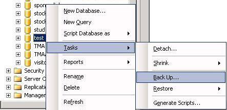

# How to Take Backup

Steps to take backup of the application:  
1. Inactivate all the integrations if any active.  
2. Stop the OpsHub server, if it is running.  
3. Take database backup (refer to the [Database Backup](#database-backup) section).  
4. Take application backup (refer to the [Application Backup](#application-backup) section).  

## Application Backup

Steps for taking the application backup:  
* Navigate to the parent directory of OpsHub installation directory (given at the time of installation).  
* Copy the application installation directory.  
* Paste above copied directory to the place where you want to keep backup.  
For Example: OpsHub is installed at path `C:\Program Files\OpsHub` then copy OpsHub directory from `C:\Program Files`.  

## Database Backup

### HSQL Database Backup
* In case of HSQL, only application backup is enough to take back up of the database as well.

### MS SQL Database Backup
* Open your Microsoft SQL Server Management Studio, whichever you prefer, Standard or Express edition.  
* Using your Database Username and Password, simply login to your MS SQL server database.  
* **Select the database >> Right-click >> Tasks >> Back Up**:  



* Once you click on the **Backup** the following Backup Database window will appear:  


: Select the following options:
1. Backup type: Full  
2. Under Destination, Backup to: Disk  
3. Click the OK button.

* Select the destination folder for the backup file, and enter the "File name" with `.bak` extension. Your Backup is ready now.  

### MySQL Database Backup
[Note: Take backup of the both databases `opshub` and `reportsdb` which were provided while creating the database. If the database was manually created, the name would differ in that case.]  
* Open Command Prompt and navigate to the `bin` directory of the MySQL server.  
* Run the `mysqldump.exe` program with the following arguments:  
```
mysqldump.exe -u [username] -p -h [hostname] [database_name] > C:\[filename].sql
```
(Note: Replace `[]` and anything inside `[]` using user's actual credentials.)  
* On clicking the enter button, it will ask for a password. Please provide the password.  

### Oracle Database Backup
* Open Command Prompt with Administrator privileges.  
* Navigate to the directory where Oracle is installed. For example:  
```
C:\Program Files\Oracle
```
* Enter Command :  
```
sqlplus
```
* It will ask for username and password. Please provide it.  
* Run the following command:  
```
$exp [Username]/[Password] OWNER=([opshub_schema],[reports_schema]) FILE="[Path where you want to dump]"
```
(For example: `$exp USERID=system/root OWNER=(opshub,reportsdb) File="C:\dumpFinal.dmp"`)

 For detailed information, you can refer to official Oracle documentation. Refer: [11g](https://docs.oracle.com/cd/E11882_01/backup.112/e10642/rcmbckba.htm#BRADV8003) or [12c](https://docs.oracle.com/database/121/BRADV/rcmbckba.htm#BRADV8003) according to installed Oracle version.

### PostgreSQL Database Backup

* Navigate to the directory where PostgreSQL is installed.  
Example:  
```
cd C:\Program Files\PostgreSQL\16\bin
```

* Run the following command using cmd with admin mode and enter the password of PostgreSQL when prompted:  
```
pg_dump -U your_username -h your_host -d your_database > `<Path where you want to dump>`
```
Example:  
```
pg_dump -U postgres -h localhost -d opshub > C:\opshub_backup.sql
```

# How to Restore

Steps to restore the application:  
* Restore Database (refer to the Database Restore section).  
* Restore Application (refer to the Application Restore section).  

## Application Restore

Steps to restore the application:  
* Copy the directory you have kept as a backup.  
* Navigate to the directory in which you want to restore the application.  
* If directory with the same name which you are going to restore, exists in current directory then delete it first.  
* Paste copied directory in step 1 to current directory.  

## Database Restore

### HSQL Database Restore
* In case of HSQL, only application restore is enough to take restoration of the database as well.

### MS SQL Database Restore
* Open your Microsoft SQL Server Management Studio Express and connect to your database. Using your Database Username and Password, simply login to your MSSQL server database.  
* **Select the database >> Right-click >> Tasks >> Restore >> Database.**  


* The following "**Restore Database**" window will appear. Select "From device" mentioned under the "Source for restore" and click the button in front of that to specify the file location.  


* Select the option "Backup media as File" and click the **Add** button to add the backup file location.  


* Select the backup file you wish to restore and click the OK button.  

### MySQL Database Restore
[Note: Restore both databases `opshub` and `reportsdb` which were provided while creating the database. If the database was manually created, the name would differ in that case.]  
* Drop and create the database with same privileges. For this, refer to [manually creation of MySQL database](../../getting-started/installation.md#queries-for-mysql-database).  
[Note: Use database and schema name as same as you used previously.]  
* Open Command Prompt and navigate to the `bin` directory of the MySQL server.  
* Run the `mysql.exe` program with the following arguments:  
```
mysql.exe -u [username] -p -h [hostname] [database_name] < C:\[filename].sql
```
(Note: Replace `[]` and anything inside `[]` using user's actual credentials.)  
* On clicking the enter button, it will ask for a password. Please provide the password.  

### Oracle Database Restore
* Drop and create schema with same privileges which you gave previously at the installation time. For this, refer to [manually creation of Oracle database](../../getting-started/installation.md#queries-for-oracle-database).  
* Open Command Prompt with Administrator privileges. Right click on cmd.exe and select "Run as Administrator".  
* Navigate to the directory where Oracle is installed. For example:  
```
C:\Program Files\Oracle
```
* Enter Command :  
```
sqlplus
```
* It will ask for username and password. Please provide it.  
* Run the following command:  
```
$imp USERID=[username]/[password] FULL=Y File="[File Path along with filename]"
```
(For example: `$imp USERID=system/root Full=Y File="C:\dumpFinal.dmp"`)

**Note** For detailed information, you can refer to official Oracle documentation. Refer: [11g](https://docs.oracle.com/cd/E11882_01/backup.112/e10642/rcmintro.htm#BRADV89341) or [12c](https://docs.oracle.com/database/121/BRADV/rcmintro.htm#BRADV89341) according to installed Oracle version.

### PostgreSQL Database

* Navigate to the directory where PostgreSQL is installed.  
Example:  
```
cd C:\Program Files\PostgreSQL\16\bin
```

* Run the following commands using cmd with admin mode and enter the password of PostgreSQL when prompted:  
- Drop the existing database:  
```
psql -U postgres -h localhost -c "DROP DATABASE your_database;"
```
- Create a new database with the same name:  
```
createdb -U postgres -h localhost -e your_database
```
- For restoring database:  
```
psql -U your_username -h your_host -d your_database < `<Path from where you want to restore the dump>`
```
Example:  
```
psql -U postgres -h localhost -d opshub < C:/opshub_backup.sql
```
